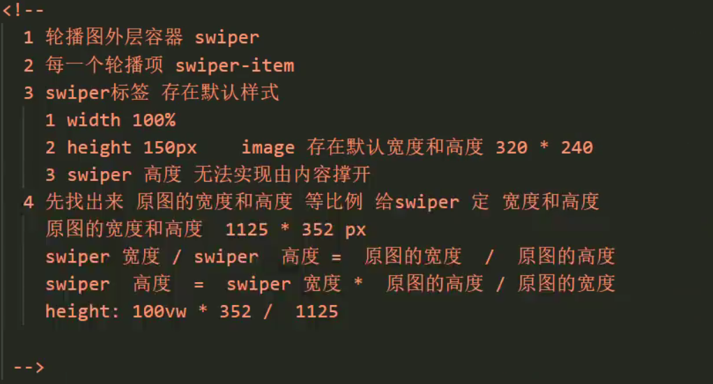

# 微信小程序开发
## 易混点
1. ":"用在js文件数值的赋值和json文件参数的赋值，"="用在标签中属性的赋值。
## 快捷键
ctrl+/：注释
ctrl+z和ctrl+y效果相反
ctrl+a全选标签
## app.json
### tabBar-跳转导航栏
```html
"list": [{
     "pagePath": "pages/index/index",
     "text": "demo01",
     "iconPath": "icon/01_出租车.png",
     "selectedIconPath": "icon/01_电动车.png",
     "color": "#0094ff"
   },
   {
    "pagePath": "pages/demo02/demo02",
    "text": "demo02",
    "iconPath": "icon/01_电动车.png",
    "selectedIconPath": "icon/01_飞机.png",
    "color": "#0094ff"
  }
  ]
```
icon图标可以去阿里巴巴icon图标里下载
## 模板语法
### 数据绑定
#### 标签
1. \<text>标签相当于\<span>，不会换行
2. \<view>标签相当于\<div>，会自动换行
3. \<checkbox>标签相当于\<input>
4. 使用Bool类型充当属性时，字符串和 花括号之间一定不要存在空格 否则会导致识别失败 以下写法就是错误示范:
    ```html
    <checkbox checked="   {{isChecked}}"></checkbox>
    ```
5. \<block>标签表示占位，在渲染的时候看不出效果，在代码分类中会隐藏掉分类标签，结合vx:for表示一个对象比较有用
    ```html
    <view>
        <block vx:for="{{person}}">{{index}}: {{item}}</block>
        <!--这样子不会换行-->
    </view>
    ```
### 列表循环

### 条件渲染

注：由hidden的实现方式可以知道，hidden和style关键字不要一起使用，否则会产生冲突

## wxss
1. 神奇的单位rpx
wx规定，所有的屏幕无论是多少px，都规定为750rpx，于是对于不同px的像素点，只需要改变成rpx单位就可以满足自适应的需求
2. 导入外部文件
```html
<!--在demo.wxss文件中使用如下代码，注意，导入的文件需要使用相对路径-->
@import "../../styles/common.wxss"
```

## swiper 轮播图
